# AuraCalc

[English](README.md)

> 一款用纯 Swift 写的轻量 macOS 计算器，安装包仅 2.4MB，免费分享。

## 前言

之前在 Windows 上一直用一款特别轻量的第三方计算器，最近一年主力换到 macOS，但那款计算器没有 Mac 版本，App Store 和第三方也都没找到合适的替代品。日常又大量依赖计算器，索性花了两周时间，用纯 Swift 自己写了一个。最终打包只有 **2.4MB**，代码量很小，但功能一点没砍。

## 特性

- **38 位高精度** — Decimal 引擎
- **三种计算模式** — 基础 / 科学 / 程序员（三角、对数、阶乘、排列组合、质因数分解、进制转换、位运算）
- **方程求解** — 牛顿法迭代
- **单位 & 货币转换** — 16 类单位 + 多源汇率缓存 + 中文大写金额
- **全生态集成** — 灵动岛 / Interactive Widget / Control Widget / Siri / Spotlight / Handoff / 菜单栏计算器
- **隐私优先** — 零数据收集，无追踪，无广告
- **跨平台** — iOS 17+ / macOS 14+（Apple Silicon Only）

## 说明

目前只有个人开发者签名（G 签），没有上架 App Store（需要缴纳 99 美金年费），所以暂时无法提供 IPA 给 iOS / iPadOS 用户，自用足够。这里把 macOS 版本的 DMG 免费分享出来，有需要的可以尝试，也欢迎提 Issue 和 PR，避免闭门造车。

图标和名字都是随手起的，图标确实比较丑，如果有擅长设计图标的朋友愿意帮忙，那就再好不过了。

## 下载

- DMG 安装包：[`AuraCalc-latest.dmg`](website/public/AuraCalc-latest.dmg)（2.2MB，arm64）
- 蓝奏云：<https://wwbvs.lanzouq.com/iV51842eq2od>

## 安全校验

- VirScan：<https://www.virscan.org/report/fe56e9e6e81873d6215cb55edac9aa714ffb5f2169bf14c944b956971af594e9>
- VirusTotal：<https://www.virustotal.com/gui/file/fe56e9e6e81873d6215cb55edac9aa714ffb5f2169bf14c944b956971af594e9>

## 截图

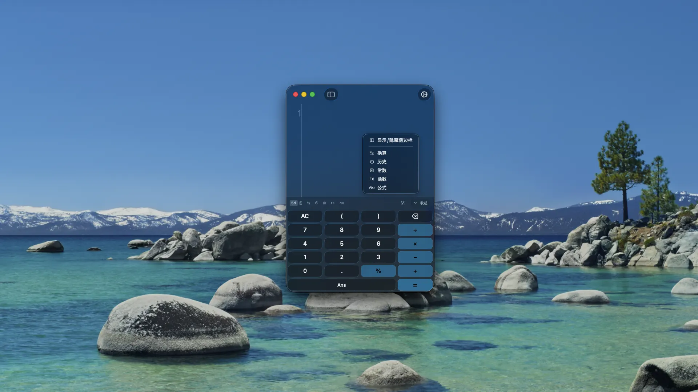
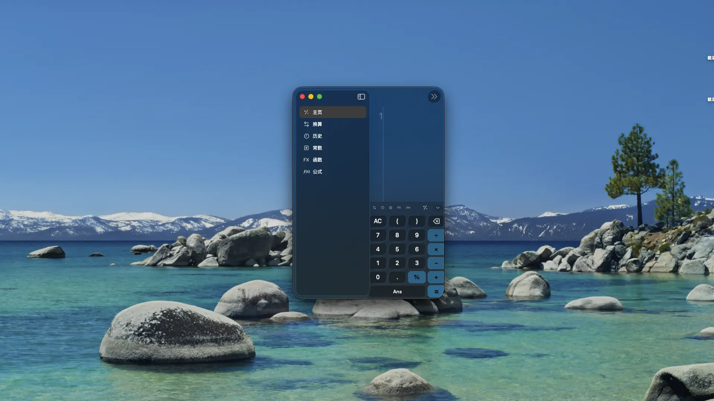
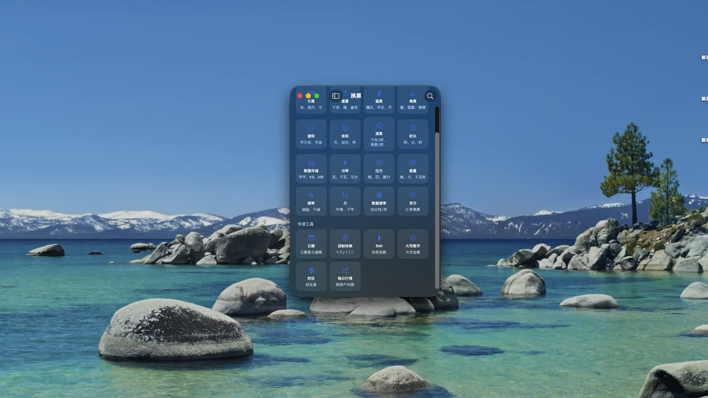
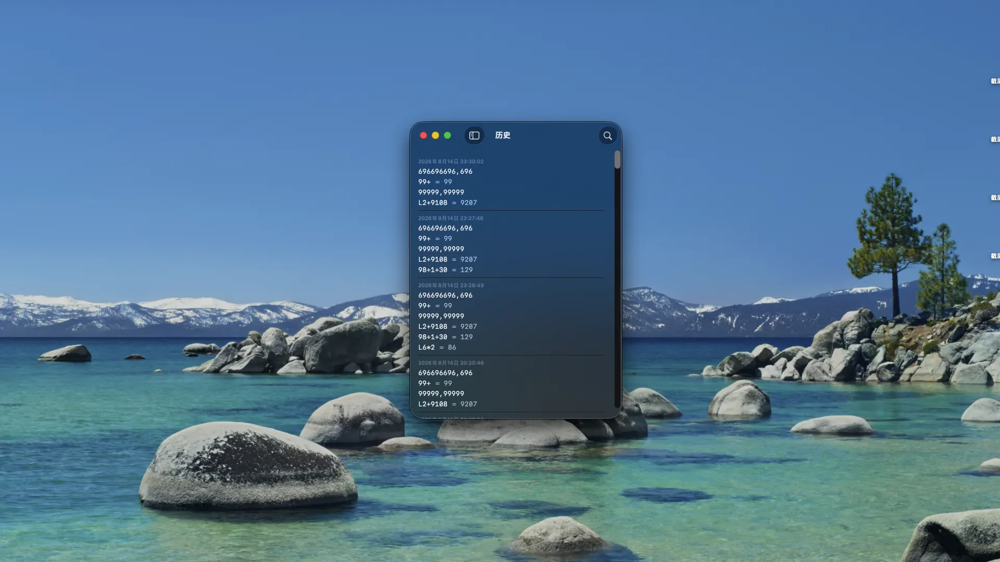

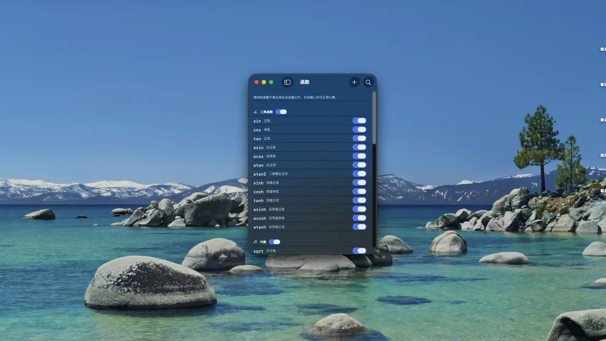
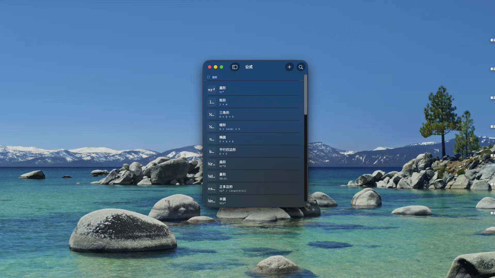
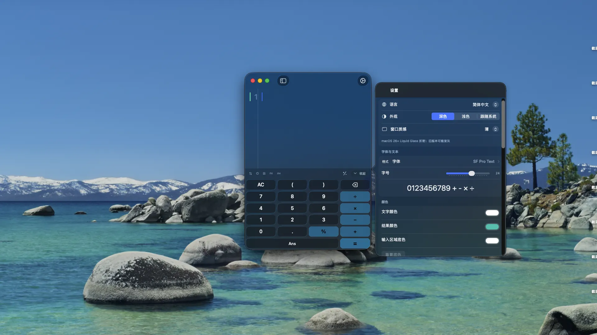
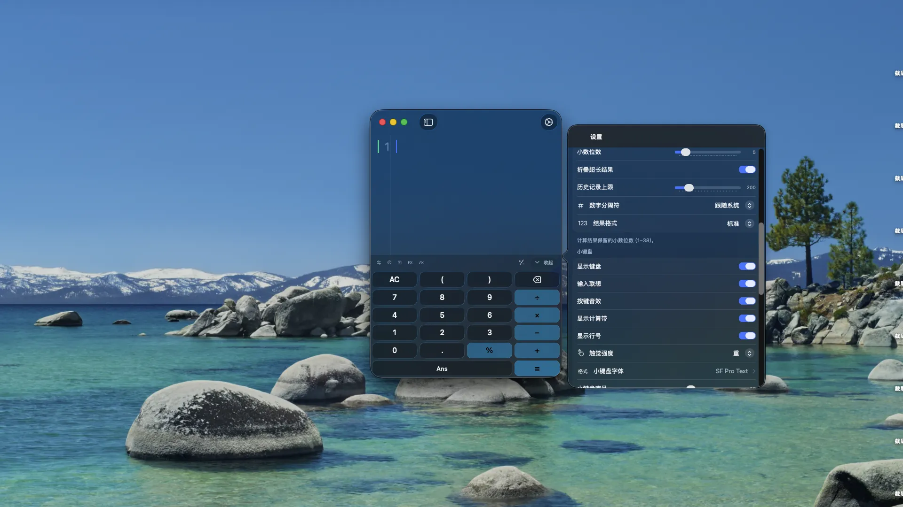
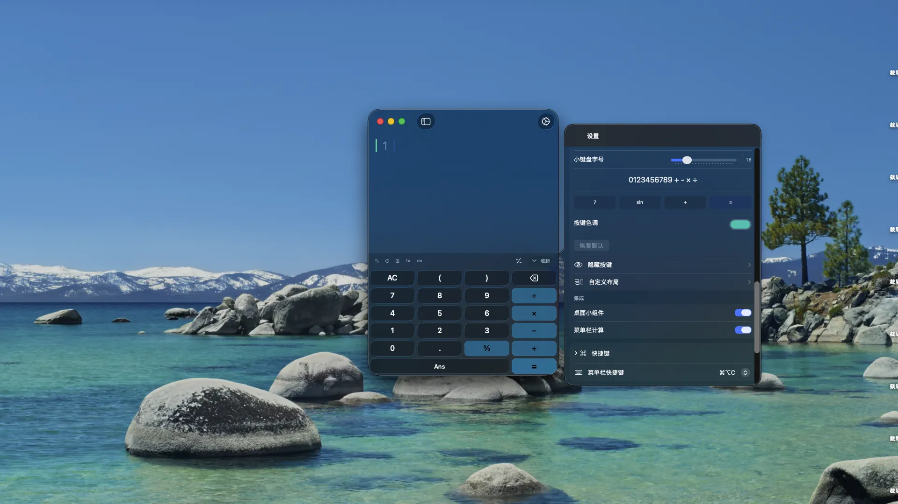
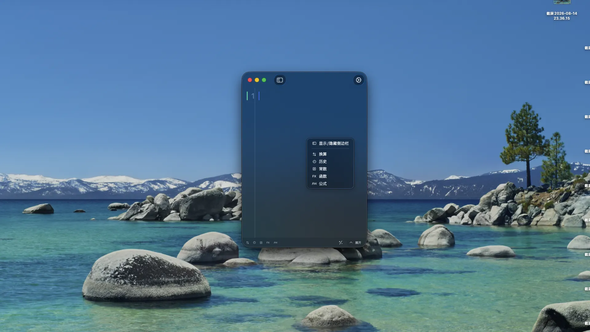
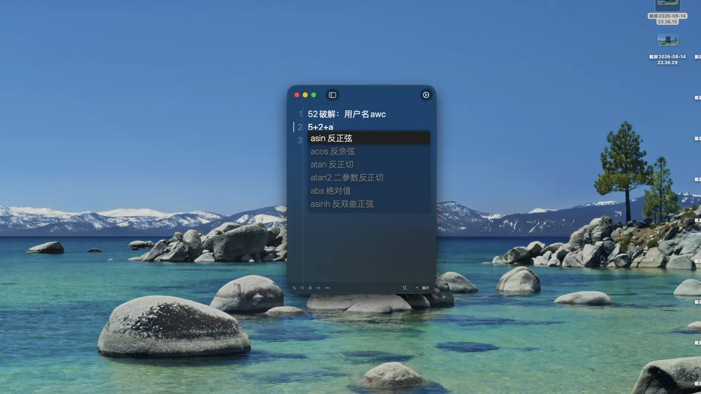

## 更新日志

查看[`website/src/content/changelog/zh-Hans/1.0.0.md`](website/src/content/changelog/zh-Hans/1.0.0.md)了解版本历史。